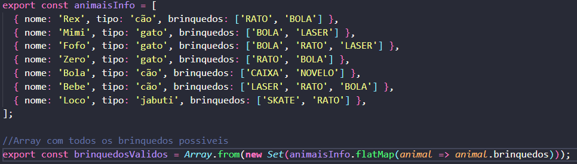
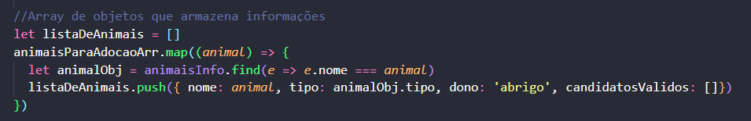
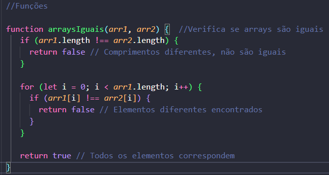

# Principais pontos da lógica usada no projeto

### O arquivo data.js armazena informações dos animais

### O Array de objetos "listaDeAnimais" armazena informação dos candidatos válidos ou dono do animal

### Todas as funções do projeto estão no final do código

